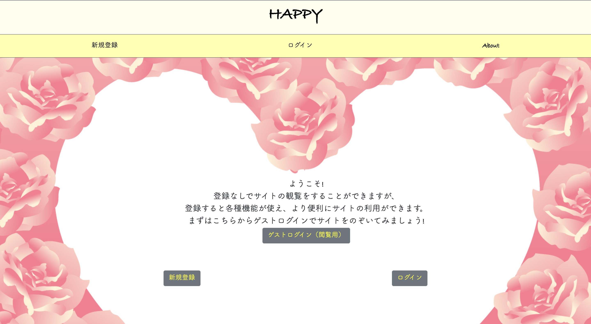

# happy

## サイト概要
### サイトテーマ
若い年齢で結婚して良かった事、若くで結婚を考えている人にアドバイスすること、幸せな日常を投稿したりできるコミュニティサイト

### テーマを選んだ理由
婚活相談所を経営している友人と話をしていると、「少子化」「未婚化」「晩婚化」「非婚化」など社会問題もあり、若い層に結婚にマイナスなイメージがまだ根強いです。
そこで若く結婚した人の幸せな日常やアドバイスなどで、結婚にプラスのイメージができるきっかけになればと思いこのテーマにしました。

### ターゲットユーザ
・結婚をされている方

・結婚を考えている方

・結婚に興味がある方

・幸せな気持ちになりたい方

### 主な利用シーン
・結婚について、経験者のリアルな意見が欲しいとき

・結婚生活の思い出を日記感覚に残したいとき

・幸せな投稿を見て幸せな気持ちになりたいとき

・結婚生活に便利な情報を知りたいとき

## 実装機能リスト
https://docs.google.com/spreadsheets/d/1ycOK7pZJ6--5WOjgOkr4MYEIUnRomlKanqFRaXlnxGs/edit?usp=sharing

## 設計書

## 開発環境
- OS：Linux(CentOS)
- 言語：HTML,CSS,JavaScript,Ruby,SQL
- フレームワーク：Ruby on Rails
- JSライブラリ：jQuery
- IDE：Cloud9

## 使用素材
### 写真素材（フリー）
・O-DAN https://o-dan.net/ja/
### イラスト素材（フリー）
・イラストAC https://www.ac-illust.com/
### フォント素材（フリー）
・Font-familyメーカー https://saruwakakun.com/font-family